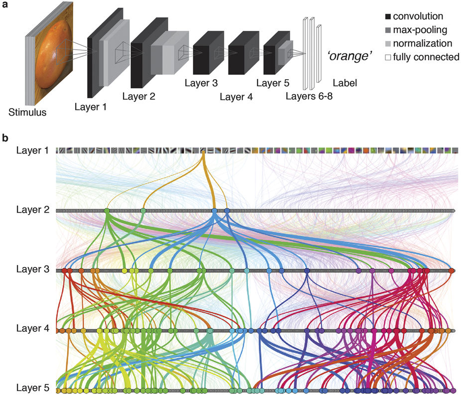
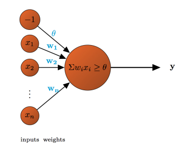
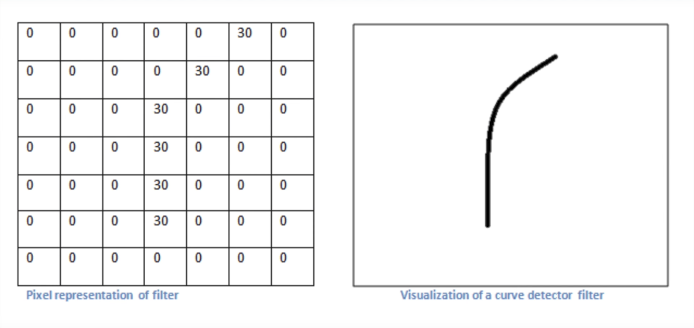
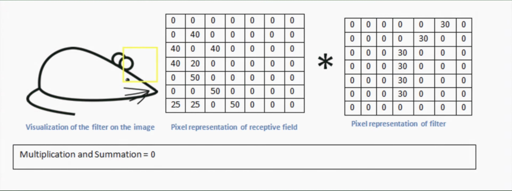

## Classificando imagens com deep learning e TensorFlow :cat2: 

Neste projeto vamos treinar um modelo que utiliza Rede Neural Convolucional (Convolutional Neural Network) para estimar a raça de um gato qualquer a partir de uma foto. Usaremos para isto o TensorFlow, uma biblioteca de machine learning bastante popular.

## Lista de requisitos
* Docker

## Definições
Rede Neural Convolucional (Convolutional Neural Network - CNN) é uma classe de rede neural utilizada para processamento e análise de imagens. Foi proposta em 1998 em um paper de Yann LeCun, que propôs uma arquitetura capaz de reconhecer dígitos manuscritos com precisão de 99,2%. Esta arquitetura foi inspirada em uma pesquisa de 1968 por David Hunter Hubel e Torsten Wiesel sobre o funcionamento do córtex visual dos mamíferos.

A pesquisa sugere que mamíferos percebem o mundo visualmente de forma hierárquica, através de camadas de clusters de neurônios. Quando vemos algo, clusters são ativados hierarquicamente, e cada um detecta um conjunto de atributos sobre o que foi visto.

A arquitetura da CNN simula clusters de neurônios para detectar atributos daquilo que foi visto, organizados hierarquicamente e de forma abstrata o suficiente para generalizar independentemente de tamanho, posição rotação, etc.



[1]

### Rede Neural

Uma rede neural artifical (ANN) é uma estrutura que simula o funcionamento de um conjunto de neurônios. A ANN mais simples é aquela composta de apenas um neurônio, chamada perceptron. Um perceptron possui:

* diversas entradas com seus respectivos pesos
* um valor limite, utilizado para decidir se o perceptron "dispara"
* um valor de saída (0 ou 1)



[2]

Ao juntar muitos perceptrons, formamos uma rede, uma rede neural artificial.

Para treinar um perceptron, comparamos o resultado obtido com o resultado esperado, e mudamos os pesos das entradas com o objetivo de minimizar o erro obtido.

Por exemplo: imagine que vamos treinar uma rede neural para classificar se um e-mail é ou não spam. As entradas podem ser:

* O tamanho do e-mail
* O horário em que foi enviado
* Se conheço ou não quem o enviou
* Se já recebi outros e-mails do mesmo remetente
* As palavras no assunto e no corpo do e-mail

E a saída é 0 (não spam) ou 1 (spam). Conforme a rede é treinada (usa a diferença entre o resultado obtido e o resultado esperado para alterar os pesos que agem sobre as entradas, afim de minimizar o erro), ela aprende as características e a relevância de cada característica para indicar se um e-mail é ou não spam.

**Deep Learning** é o uso de uma rede neural com muitas camadas.

### Convolucional

Convolução pode ser visto como sinônimo de combinação. É o procedimento de combinar duas fontes de informação.

### Imagem

O input da CNN é uma imagem, representada como uma matriz. Cada elemento da matriz contém o valor de seu respectivo pixel, que pode variar de 0 a 255. Para imagens coloridas em RGB temos uma matriz "em três dimensões", onde cada dimensão é uma das camadas de cor (red, green e blue). Assim, uma imagem colorida de 255px por 255px é representada por três matrizes de 255 por 255 (255x255x3).

### Atributo

Um atributo é um padrão que a CNN aprende. Normalmente este padrão se repete nas imagens, tornando-o proeminente. O contorno dod objetos (linhas, formas, abstrações) é um exemplo de atributo.

### Kernel/filtro

Pode ser imaginada como uma matriz menor composta de valores. Ela é aplicada à imagem (convolução), para obter regiões de ativação, ou seja, regiões onde atributos específicos deste filtro foram encontrados.

Por exemplo, podemos imaginar um filtro de 16 x 16 percorrendo uma imagem de 256 x 256 x 3. A cada etapa pegamos uma porção de 16 x 16 da imagem e fazemos a convolução (ou seja, calculamos o produto escalar entre as duas matrizes). O valor obtido é adicionado à matriz de ativação. Este processo é repetido até todas as três matrizes terem sido percorridas completamente.


[3]

Os valores do filtro mudam a cada iteração de treinamento, com o objetivo de melhorar a identificação de quais regiões contém atributos significativos (da mesma forma que os pesos em um perceptron são atualizados no treinamento).

Como esta série de multiplicações nos ajuda a detectar os atributos de uma imagem? Conforme o filtro aprende a detectar um atributo (através do processo de aprendizado), seus valores se ajustam de forma que o resultado da convolução seja um valor que indique que o determinado atributo foi encontrado:






[4]

Neste exemplo, quando o resultado da convolução é um número grande, isto indica que o atributo foi detectado. Já quando é um resultado 0 ou muito pequeno, o atributo não foi encontrado.

## Arquitetura da CNN

### Convolutional Layer

Responsável por fazer a convolução na imagem. A cada iteração, os pesos nesta camada são atualizados usando um algoritmo de back-propagation.

### ReLu Layer

Age como função de ativação (define o valor da saída dadas as entradas) para a saída de cada neurônio da CNN. Transforma todos os valores que não são importantes na detecção do atributo em 0.

### Pooling Layer

Geralmente colocada depois da Convolutional Layer, serve para reduzir as dimensões da matriz para a próxima camada. Com esta redução temos perda de informação, porém, isto é bom pois diminui a complexidade computacional de processar a matriz, e também auxilia para evitar o overfiting.

## Treinando nossa CNN

Neste exemplo, não iremos escrever nossa CNN, mas sim treinar uma pronta utilizando um processo chamado Transfer Learning. Com Transfer Learning, usamos uma CNN já treinada, e adicionamos uma camada a mais, com aquilo que queremos treinar.

No nosso caso, usaremos a CNN Inception-V3 do Google, que foi treinada em cima da base de dados ImageNet, e a ensinaremos a classificar a raça de gatos.

### Passo 1

Baixar e instalar o Docker. Iremos usar uma imagem que possui o TensorFlow já instalado.

Uma vez instalado, podemos executar o seguinte comando para conferir se está tudo ok:

`docker run hello-world`

### Passo 2

Baixar a imagem do TensorFlow:

`docker pull tensorflow/tensorflow:1.1.0`

### Passo 3

Iniciar o container baseado na imagem do TensorFlow, mapeando um diretório entre a máquina física e o container:

```
docker run -it --volume ${HOME}/tf_files:/tf_files --workdir /tf_files --publish 6006:6006 tensorflow/tensorflow:1.1.0 bash
```

* [`-it`](https://docs.docker.com/engine/reference/run/#foreground): processo interativo
* [`--volume <host>:<container>`](https://docs.docker.com/engine/reference/run/#volume-shared-filesystems): monta um volume, linkando uma pasta no host com uma no container
* [`--workdir <dir>`](https://docs.docker.com/engine/reference/run/#workdir): diretório no container onde vamos executar os comandos
* [`--publish <host>:<container>`](https://docs.docker.com/engine/reference/run/#network-settings): mapeamento entre porta do host e a porta no container

### Passo 4

Colocar neste diretório os arquivos necessários para treinar a CNN:

* Uma pasta chamada `cats`, contendo uma pasta para cada categoria que queremos treinar. No nosso caso teremos uma pasta para cada raça de gato. O nome da pasta será o nome da categoria, o nome da raça do gato. Dentro das pastas, teremos as imagens dos gatos.
* Script `retrain.py` que contém os comandos para treinar a CNN.
* Script `label_image.py` que usaremos para consultar a CNN treinada, ou seja, passaremos a imagem de um gato e perguntaremos qual sua raça.

**Obs. 1:** Você deve montar ou utilizar um conjunto de dados com as imagens das raças desejadas. Eu utilizei um subconjunto do desafio [Dogs vs. Cats do Kaggle](https://www.kaggle.com/c/dogs-vs-cats).

**Obs. 2:** Para facilitar, coloquei na pasta `scripts` deste repositório os dois scripts necessários.

### Passo 5

Iniciar o treinamento:

```
python -m retrain \
  --bottleneck_dir=bottlenecks \
  --how_many_training_steps=500 \
  --model_dir=models/ \
  --summaries_dir=training_summaries/"${ARCHITECTURE}" \
  --output_graph=retrained_graph.pb \
  --output_labels=retrained_labels.txt \
  --architecture="${ARCHITECTURE}" \
  --image_dir=cats
```

Este script irá baixar o inception model e depois iniciará o treinamento com base nas imagens e categorias que informamos. Irá iretar 500 vezes para treinar o modelo, e salvará o resultado no arquivo `retrained_graph.pb`.

O tempo de execução varia de acordo com a quantidade de imagens para treinar e a velocidade do computador. Em um teste que fiz com 12 raças, cada uma contendo em torno de 200 imagens, o treinamento demorou mais ou menos 30 minutos em um i5 com 8 GB de RAM.

### Passo 6

Consultar o modelo gerado. Vamos colocar na pasta `tf_files` uma imagem de um gato qualquer, e perguntar qual a raça:

`python label_image.py gato.jpg`

## Próximos passos

É possível pegar este modelo treinado e utilizá-lo em um aplicativo mobile. Uma ideia seria abrir a câmera, apontar para um gato, e usar o modelo que treinamos para identificar qual a raça.

Veja [este link](https://www.tensorflow.org/mobile/) para mais informações.

Para iOS temos também a alternativa de converter este modelo TensorFlow para um modelo [Core ML](https://developer.apple.com/machine-learning/), a solução nativa de machine learning para dispositivos Apple. Porém ainda não há suporte nativo para esta conversão, portanto teríamos que procurar soluções de terceiros, ou escrever nossa própria solução.

## Fontes e créditos

Este tutorial não seria possível sem o estudo das seguintes referências:

* **Siraj Raval:** [Convolutional Network](https://github.com/llSourcell/Convolutional_neural_network)
* **Siraj Raval:** [Convolutional Neural Networks - The Math of Intelligence (Week 4)](https://youtu.be/FTr3n7uBIuE)
* **Hacker House:** [Easy Image Classification with Tensorflow](https://youtu.be/qaQofXTxkSo)
* **Google Codelabs:** [TensorFlow for Poets](https://codelabs.developers.google.com/codelabs/tensorflow-for-poets/)
* **Abhineet Saxena:** [Convolutional Neural Networks (CNNs): An Illustrated Explanation](http://xrds.acm.org/blog/2016/06/convolutional-neural-networks-cnns-illustrated-explanation/)
* **Udacity:** [Neural Networks](http://video.udacity-data.com.s3.amazonaws.com/topher/2017/November/5a01aef2_neural-networks/neural-networks.pdf)
* **Guilherme Silveira:** [Machine Learning: Introdução à classificação](https://www.casadocodigo.com.br/products/livro-machine-learning)

### Imagens

* [1], [3] e [4] https://github.com/llSourcell/Convolutional_neural_network/blob/master/convolutional_network_tutorial.ipynb
* [2] http://video.udacity-data.com.s3.amazonaws.com/topher/2017/November/5a01aef2_neural-networks/neural-networks.pdf

### Scripts

Os scripts utilizados fazem parte do tutorial TensorFlow for Poets, e foram obtidos com os segiuntes comandos:

```
curl -O https://raw.githubusercontent.com/tensorflow/tensorflow/r1.1/tensorflow/examples/image_retraining/retrain.py
```

```
curl -L https://goo.gl/3lTKZs > label_image.py
```